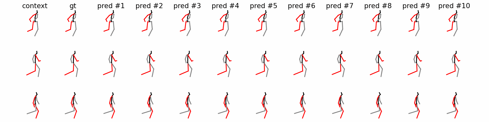
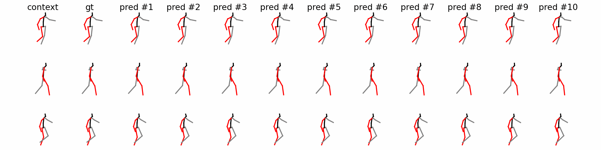
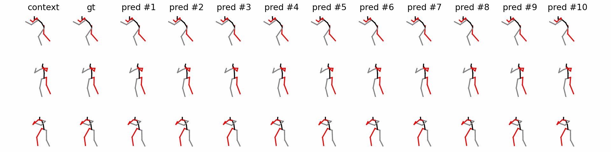
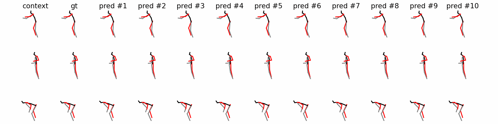
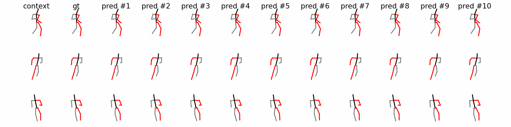
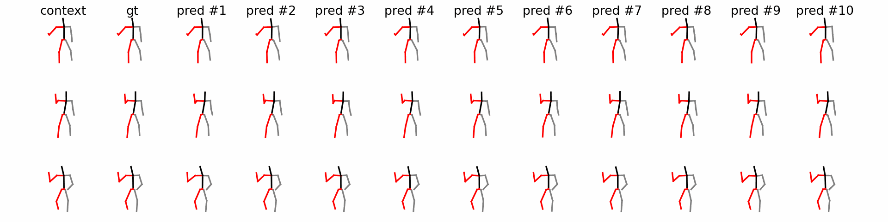
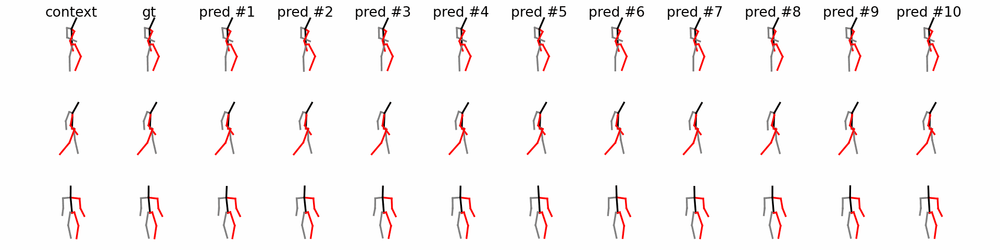
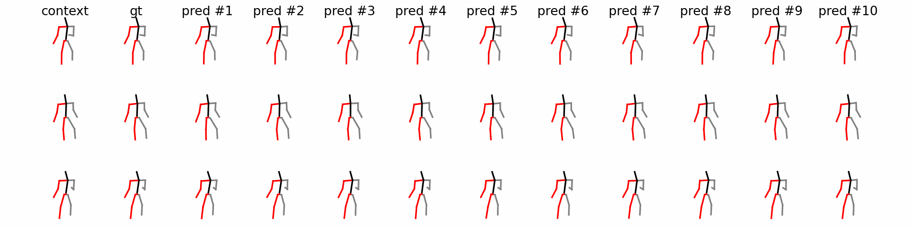
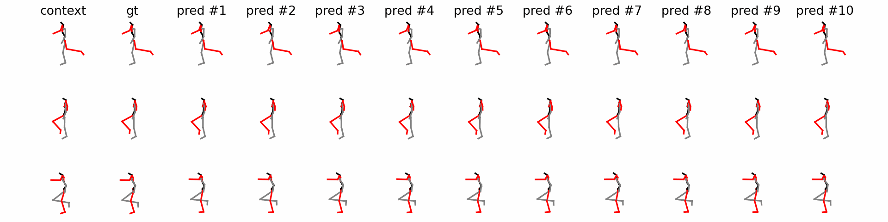
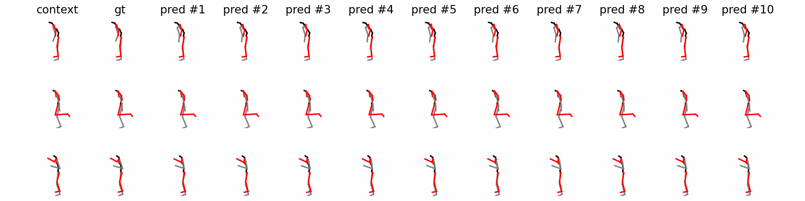

# [IEEE RA-L] TransFusion
#### TransFusion: A Practical and Effective Transformer-based Diffusion Model for 3D Human Motion Prediction

[Sibo Tian](https://scholar.google.com/citations?hl=en&user=fv-tcZIAAAAJ)<sup>1</sup>, [Minghui Zheng](https://engineering.tamu.edu/mechanical/profiles/zheng-minghui.html)<sup>1,\*</sup>, [Xiao Liang](https://engineering.tamu.edu/civil/profiles/liang-xiao.html)<sup>2,\*</sup>

<sup>1</sup>J. Mike Walker ’66 Department of Mechanical Engineering, Texas A&M University, <sup>2</sup>Zachry Department of Civil and Environmental Engineering, Texas A&M University, <sup>\*</sup>Corresponding Authors

[[IEEE Xplore](https://ieeexplore.ieee.org/abstract/document/10530938)] | [[Code](https://github.com/sibotian96/TransFusion)]

> Predicting human motion plays a crucial role in ensuring a safe and effective human-robot close collaboration in intelligent remanufacturing systems of the future. Existing works can be categorized into two groups: those focusing on accuracy, predicting a single future motion, and those generating diverse predictions based on observations. The former group fails to address the uncertainty and multi-modal nature of human motion, while the latter group often produces motion sequences that deviate too far from the ground truth or become unrealistic within historical contexts. To tackle these issues, we propose TransFusion, an innovative and practical diffusion-based model for 3D human motion prediction which can generate samples that are more likely to happen while maintaining a certain level of diversity. Our model leverages Transformer as the backbone with long skip connections between shallow and deep layers. Additionally, we employ the discrete cosine transform to model motion sequences in the frequency space, thereby improving performance. In contrast to prior diffusion-based models that utilize extra modules like cross-attention and adaptive layer normalization to condition the prediction on past observed motion, we treat all inputs, including conditions, as tokens to create a more practical and effective model compared to existing approaches. Extensive experimental studies are conducted on benchmark datasets to validate the effectiveness of our human motion prediction model.

## News

**[2024/05/23]: Code released!**

**[2024/04/28]: Our work is accepted by IEEE Robotics and Automation Letters (RA-L)!**

**[2024/03/25]: TransFusion prediction demos released!**

## Demos of Human Motion Prediction

More prediction demos can be found in `./assets`.

#### Human3.6M -- Walking


#### Human3.6M -- Walk Together


#### Human3.6M -- Photo


#### Human3.6M -- Purchases


#### HumanEva-I -- Jog


#### HumanEva-I -- ThrowCatch


#### HumanEva-I -- Walking


#### HumanEva-I -- Gestures


#### AMASS -- DanceDB


#### AMASS -- DFaust


#### AMASS -- SSM


#### AMASS -- Transitions


## Citation
If you find our work useful in your research, please consider citing our paper:
```
@article{tian2024transfusion,
  title={TransFusion: A practical and effective transformer-based diffusion model for 3d human motion prediction},
  author={Tian, Sibo and Zheng, Minghui and Liang, Xiao},
  journal={IEEE Robotics and Automation Letters},
  year={2024},
  publisher={IEEE}
}
```
